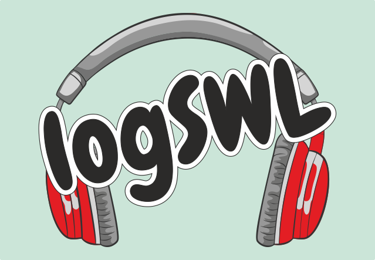

# logSWL
Journal de trafic opensource pour les radio-écouteurs.

Il est développé avec les fonctions dont j'ai besoin, et qui me semblent essentielles.\

Ceci est mon premier logiciel en python (j'apprends le python en créant ce logiciel  :smiley: ).

## Prérequis
Ce programme nécessite Python3.12 , pyQT5.15 ainsi que [ADIF-FILE](https://github.com/gitandy/PyADIF-File) 1.3

## Roadmap
- [x] 01/10/2024 Première version permettant d'enregistrer, modifier, et supprimer des QSO.
- [x] 05/10/2024 Export ADIF pour eqsl.cc/qrzcq.com
- [x] 10/10/2024 Carte des pays écoutés
- [x] 15/10/2024 Ajout de la traduction de l'application
- [x] 18/10/2024 La map des QSO peut maintenant être filtrée par BAND, et elle est centrée sur votre locator (à la place de Paris)
- [x] 30/10/2024 Possibilité de voir l'image reçu d'un QSO SSTV
- [x] 07/11/2024 intégration API QRZCQ

## Contributions
Pour faire progresser logSWL, vous pouvez contribuer en :
- Signalant les erreurs ou problèmes rencontrés
- Indiquant les fonctionnalités souhaitées
- 

## License
Ce programme est sous licence [GPL-3.0](https://choosealicense.com/licenses/gpl-3.0/)